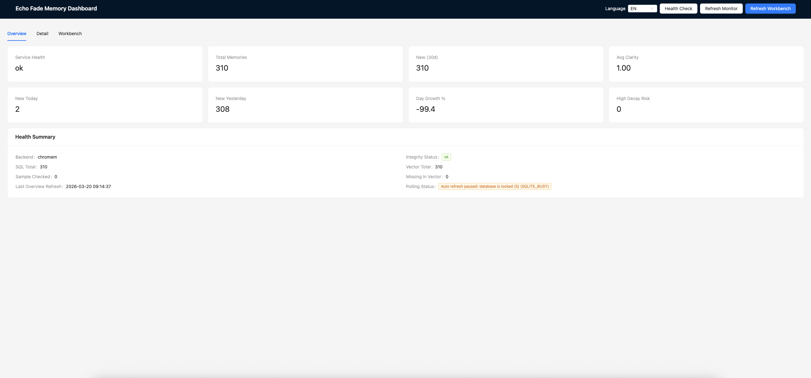
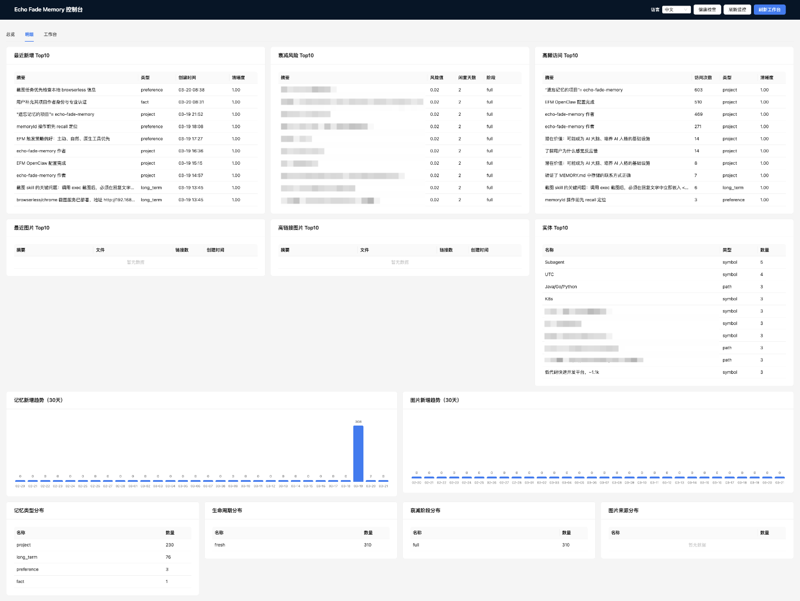
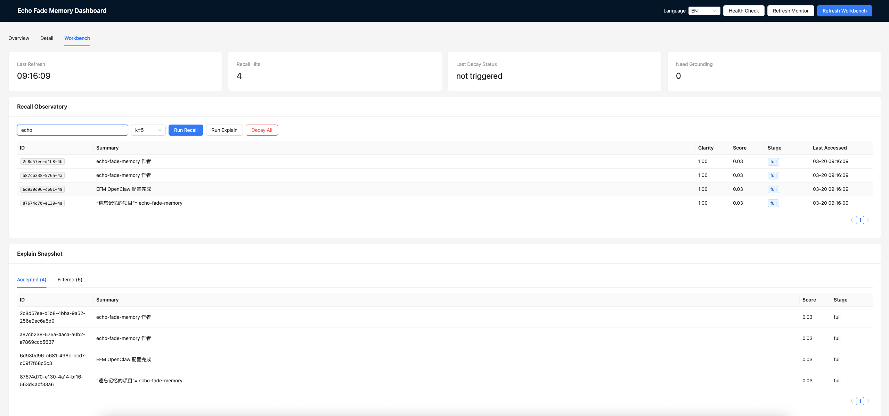

# Echo Fade Memory

An **AI memory middleware** built for forgetting. It helps agents remember, decay, recall, ground, and eventually forget information in a controlled, explainable way.

**定位**：面向 AI Agent 的可衰减记忆中间件。它不是完整 Agent 框架，也不是会话上下文替代品，而是基础设施层的记忆生命周期引擎。详见 [docs/CORE.md](docs/CORE.md)。

---

## Documentation

| Language | Plan / 规划 |
| -------- | ----------- |
| [English](docs/PLAN.en.md) | Architecture, roadmap, tech stack |
| [中文](docs/PLAN.zh.md) | 架构设计、实现路径、技术选型 |

---

## Overview

- **Forgetting as a feature**: this is not just a memory store, but a memory lifecycle engine.
- **Explainable recall**: recall returns `score`, `strength`, `freshness`, `fuzziness`, `decay_stage`, `source_refs`, `why_recalled`, and `needs_grounding`.
- **Multi-form memory**: one memory can carry raw content, summary, embedding, residual content, lifecycle state, and source references.
- **Pluggable runtime**: use it from CLI, HTTP API, and later MCP / SDK integrations.

---

## 概述

- **遗忘即特性**：不是单纯"存得更多"，而是让记忆按生命周期演化。
- **可解释召回**：召回结果不仅有内容，还会返回 `score`、`strength`、`freshness`、`why_recalled`、`needs_grounding` 等字段。
- **多形态记忆**：同一条记忆可同时拥有原文、摘要、embedding、残留内容、来源引用和生命周期状态。
- **基础设施层定位**：上层 `SKILL` 或 agent framework 负责策略编排，本项目负责底层记忆执行。

---

## Dashboard Snapshot

`/dashboard` 现在提供一个面向 Phase 2 的轻量观察与操作面板：

- `Overview`: 全局 KPI、健康状态、memory/image/entity 对齐情况
- `Detail`: Top-N、趋势、分布、覆盖率等分析视图
- `Workbench`: 一个统一输入框联动 memory、image、entity 的 federated recall

### Overview



### Detail



### Workbench



Integrity check mode defaults to lightweight:

- compare SQL total vs vector total when backend supports count;
- run sampled ID checks (default `sample_size=200`) when backend supports ID existence checks.

---

## Quick Start

**Prerequisites**: [Go 1.26+](https://go.dev/dl/), [Ollama](https://ollama.ai/) with `nomic-embed-text` model.

Canonical Go module path: `github.com/hiparker/echo-fade-memory`.

The default vector backend is `local`, so a plain `make build` / `make test` flow stays dependency-light.
By default, runtime assets now live under `~/.echo-fade-memory`, with data isolated per workspace.

```bash
# Pull embedding model
ollama pull nomic-embed-text

# Build
make build

# Remember a memory
./echo-fade-memory remember "Project meeting: decided to use Go and Bleve for Phase 1"

# Recall with explainable fields
./echo-fade-memory recall "meeting decision"

# Reinforce a memory after reuse
./echo-fade-memory reinforce <memory_id>

# Ground a fuzzy memory back to its sources
./echo-fade-memory ground <memory_id>

# HTTP API
./echo-fade-memory serve
# HTTP API (custom runtime home for local debugging)
./echo-fade-memory serve --workdir /Users/system/.echo-fade-memory --workspace debug-local
# HTTP API (custom runtime + port)
./echo-fade-memory serve --workdir /Users/system/.echo-fade-memory --workspace debug-local --port 9090
# POST   /v1/memories {"content":"...", "memory_type":"project", "source_refs":[...]}
# GET    /v1/memories?q=query
# POST   /v1/memories/<id>/reinforce
# GET    /v1/memories/<id>/ground
# POST   /v1/memories/explain {"query":"..."}
# POST   /v1/memories/decay
# POST   /v1/tools/store {"content":"..."} or {"object_type":"image","file_path":"..."}
# POST   /v1/tools/recall {"query":"...","k":5}
# POST   /v1/tools/forget {"query":"...","object_type":"memory|image"} or {"id":"..."}
# GET    /v1/dashboard/stats/overview?window_days=30
# GET    /v1/dashboard/stats/integrity?sample_size=200
# GET    /v1/dashboard/stats/detail?window_days=30&top_k=10&sample_size=200
# POST   /v1/dashboard/workbench/query {"query":"...","k":5}
# Dashboard: GET /dashboard
```

**Docker**:

```bash
# 方式一：先启动外部 Ollama 容器，再启动 echo-fade-memory
# 默认 chromem（纯 Go 嵌入式向量库）
./scripts/start-ollama-embedding.sh
docker compose up --build

# 方式二：含 Ollama，自动拉取 nomic-embed-text
docker compose -f docker-compose.ollama.yml up --build
```

---

## Configuration

Copy `config.example.json` to `config.json` and customize:

| Section | Key | Description |
|---------|-----|-------------|
| embedding | type, url, model, dimensions, api_key, base_url | `type`: ollama, openai, gemini; `url` for ollama; `api_key` for openai/gemini |
| decay | tau, alpha, epsilon | strength = 1/(1+(t/τ)^α) × reinforce; tau=halflife, alpha=shape |
| vector_store | type, path, milvus_host, milvus_port, milvus_db | `local`, `chromem` (Docker default), `milvus` |
| storage | type, path | `sqlite` (default), `postgres`, `mysql` |

Env vars: `EMBEDDING_TYPE`, `EMBEDDING_URL`, `EMBEDDING_MODEL`, `EMBEDDING_API_KEY`, `ECHO_FADE_MEMORY_HOME`, `ECHO_FADE_MEMORY_WORKSPACE`, etc.

**OpenAI**: `"embedding": {"type": "openai", "model": "text-embedding-3-small", "api_key": "sk-..."}` (or `OPENAI_API_KEY`)

**Gemini**: `"embedding": {"type": "gemini", "model": "text-embedding-004", "api_key": "..."}` (or `GOOGLE_API_KEY`)

**Priority**: Default < config.json < Env

### Runtime Layout

By default the project uses a global runtime home:

```text
~/.echo-fade-memory/
  workspaces/<workspace-id>/
    data/
      memories.db             # SQLite metadata
      vector/
        local/vectors.json    # local vector backend
        chromem/              # chromem-go persistent data
      bleve/                  # full-text index
```

- `ECHO_FADE_MEMORY_HOME` overrides the global runtime root.
- `ECHO_FADE_MEMORY_WORKSPACE` overrides the derived workspace id.
- `DATA_PATH` still wins if you want a fully custom data directory.
- Docker compose files bind-mount `${HOME}/.echo-fade-memory` to `/root/.echo-fade-memory` and set a stable `ECHO_FADE_MEMORY_WORKSPACE`.

`serve` also supports runtime overrides via CLI flags (equivalent to env vars):

```bash
./echo-fade-memory serve --workdir /Users/system/.echo-fade-memory
./echo-fade-memory serve --workdir /Users/system/.echo-fade-memory --workspace debug-local
./echo-fade-memory serve --workdir /Users/system/.echo-fade-memory --workspace debug-local --port 9090
./echo-fade-memory serve --help
```

### Vector Backends

- `local`: pure Go, stores vectors in `vectors.json`; default for `make build` / `make test`.
- `chromem`: pure Go embedded vector database ([chromem-go](https://github.com/philippgille/chromem-go)); default for Docker. Persistent, no external service needed.
- `milvus`: external service backend for larger or remote deployments.

Invalid `vector_store.type` values fail fast at startup.

---

## Memory Shape

Each memory can include:

- `content`: original text
- `summary`: a compact recall-oriented representation
- `memory_type`: `long_term`, `working`, `preference`, `project`, `goal`
- `lifecycle_state`: `fresh`, `reinforced`, `weakening`, `blurred`, `archived`, `forgotten`
- `source_refs`: provenance pointers such as chat/file/github/url
- `residual_form` and `residual_content`: the current faded view
- `conflict_group` and `version`: lightweight versioning scaffold for same-topic memories

## API Snapshot

Agent-facing HTTP routes are now intentionally thin:

- `POST /v1/tools/store`
- `POST /v1/tools/recall`
- `POST /v1/tools/forget`

Core memory and debug HTTP routes remain available:

- `POST /v1/memories`
- `GET /v1/memories?q=...`
- `POST /v1/memories/explain`
- `POST /v1/memories/decay`
- `GET /v1/memories/:id`
- `DELETE /v1/memories/:id`
- `POST /v1/memories/:id/reinforce`
- `GET /v1/memories/:id/ground`
- `GET /v1/memories/:id/reconstruct`
- `GET /v1/memories/:id/versions`
- `GET /v1/healthz`
- `GET /v1/readyz`
- `GET /v1/dashboard/stats/overview?window_days=30`
- `GET /v1/dashboard/stats/integrity?sample_size=200`
- `GET /v1/dashboard/stats/detail?window_days=30&top_k=10&sample_size=200`
- `POST /v1/dashboard/workbench/query`

